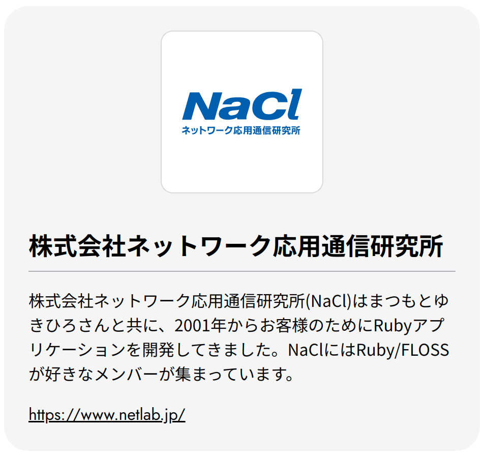
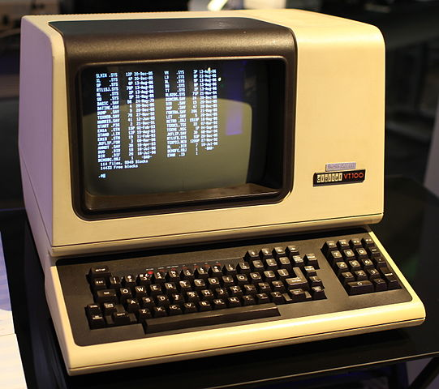

# Ruby製テキストエディタでの生活

前田 修吾  
株式会社ネットワーク応用通信研究所

## 協賛



## 本日のテーマ

* Ruby製テキストエディタでの生活

## 生活

* エレファントカシマシの4枚目のスタジオアルバム

## 晩秋の一夜

> ある夜一人で火鉢に手をかざし  
> くもった空気の部屋のうち  
> あわれああいまだに生き残る  
> はかなき虫の鳴き声と共にいた

「晩秋の一夜」作詞・作曲: 宮本浩次

## 火鉢: 消費社会におけるノスタルジーの象徴


## 端末: 情報社会におけるノスタルジーの象徴



## Textbringer

* Ruby製テキストエディタ
* Emacsライク

## 動作環境

* Linux、Windows、macOS
* Ruby 3.1以降
* 端末

## なぜ端末か

* かっこいい
* 開発が楽

## 三大厨二プロダクト


## 先人たちの偉大さ

* Emacsとそのエコシステムの資産は膨大
* GUI開発までやってられない

## Textbringer開発のきっかけ

* 昔からEmacs LispじゃなくてRubyでエディタを拡張したかった
  * cursesの拡張ライブラリはそのために作った
* 「Emacsは衰退しました」という記事
  * Emacs Advent Calendar 2016
  * glibcのmalloc_get_state()/mallc_set_state()が廃止
  * Emacsが死ぬ?

## Emacsは死んだか?

* 死ななかった
  * Emacs 27でportable dumper採用

## 「勝つ」とは

* 自分が日々の生活で使うこと

## 時には妥協も必要

```ruby
if cond1 &&
    cond2
  body
end

foo bar,
  baz
```

## 細かいこだわりがあることも

* リージョンのハイライト表示はしない
  * 手抜きではない
  * 昔のEmacsはハイライト表示してなかった
  * C-gで解除するのが面倒
  * マークしたからといって範囲選択したいとはかぎらない

## 何に使っているか

* コーディング
* メールの読み書き
* 日本語入力
* Webのフォーム編集
* プレゼンテーション

## コーディング

* Ruby
  * ほぼTextbringerの開発
  * 最初はVimで1か月以内にはセルフエディット
  * RailsはERBのインデントがつらい
* C
  * まれにRubyのコードなどをいじる
  * Rubyよりインデントがあやしい

## 日本語入力

* 標準で日本語入力をサポート
  * ローマ字入力(ひらがなのみ)
  * 漢字直接入力(T-Code)

## メール

## まとめ

## 使用素材について

* DEC VT100 terminal at the Living Computer Museum
  https://en.wikipedia.org/wiki/Computer_terminal#/media/File:DEC_VT100_terminal.jpg
  Jason Scott
  CC BY 2.0
