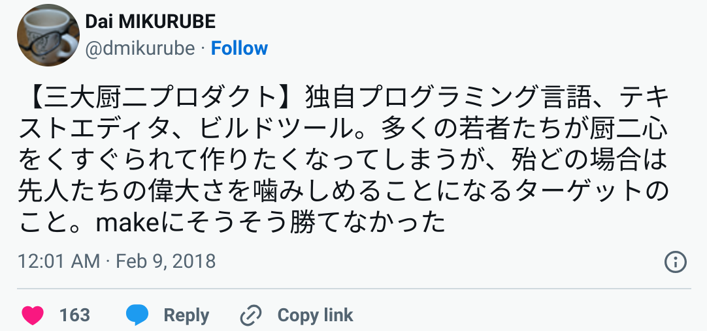

# Ruby製テキストエディタでの生活

前田 修吾  
株式会社ネットワーク応用通信研究所

## 協賛

## 本日のテーマ

* Ruby製テキストエディタでの生活

## 生活

* エレファントカシマシの4枚目のスタジオアルバム

## 晩秋の一夜

> ある夜一人で火鉢に手をかざし  
> くもった空気の部屋のうち  
> あわれああいまだに生き残る  
> はかなき虫の鳴き声と共にいた

「晩秋の一夜」作詞・作曲: 宮本浩次

## 火鉢: 消費社会におけるノスタルジーの象徴

## 端末: 情報社会におけるノスタルジーの象徴

## Textbringer

* Ruby製テキストエディタ
* 2016年末に開発開始
* Emacsライク
* 端末で動く(端末でしか動かない)

## なぜ端末か

* かっこいい
* 開発が楽

## 三大厨二プロダクト

## 先人たちの偉大さ

* Emacs
* Vim

## 「勝つ」とは

* 自分が日々の生活で使うこと

## 勝った

> 俺はお前に負けないが  
> お前は俺に負けるなよ

「男は行く」作詞・作曲: 宮本浩次

## 何に使っているか

* コーディング
* メールの読み書き
* 日本語入力
* Webのフォーム編集
* プレゼンテーション

## ブートストラップ

## 日本語入力

## メール

## 法と混沌

## まとめ

## 使用素材について

* DEC VT100 terminal at the Living Computer Museum
  https://en.wikipedia.org/wiki/Computer_terminal#/media/File:DEC_VT100_terminal.jpg
  Jason Scott
  CC BY 2.0
